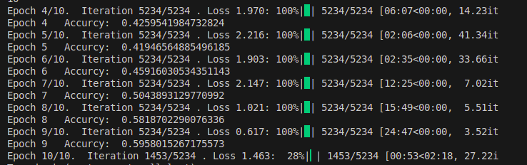
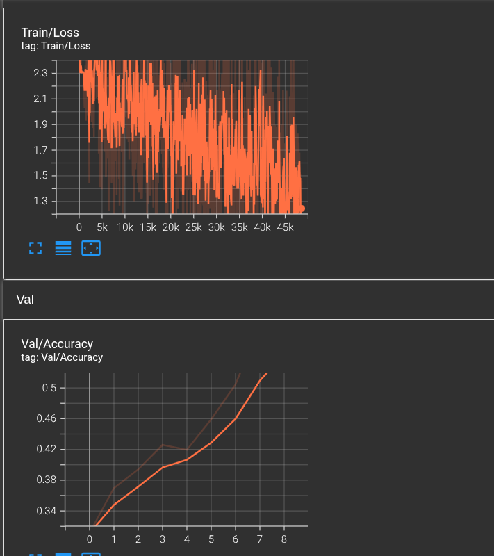

# Phân loại ảnh Animal-10 bằng PyTorch

Dự án **CNN cho 10 lớp động vật** với PyTorch, sử dụng **Batch Normalization** và **Dropout** để ổn định huấn luyện và giảm overfitting.  
Hệ thống ghi log **TensorBoard** (Train/Loss, Val/Accuracy, Confusion Matrix) và lưu **checkpoint** tốt nhất.

---

## 🧩 Công nghệ sử dụng
- **Python 3.10+**, **PyTorch**, **torchvision**
- **scikit-learn** (accuracy, confusion matrix), **TensorBoard**
- **OpenCV**, **NumPy**, **matplotlib**, **tqdm**, **torchsummary**

## 🗂️ Dữ liệu
- Cấu trúc mẫu: `root/train` và `root/test` với các thư mục con là tên lớp.
- Đường dẫn mặc định trong script: `./dataset`.

## 🧠 Kiến trúc mô hình `SimpleCNN`
Các **block tích chập** (Conv → **BatchNorm** → LeakyReLU) được lặp lại, sau đó **MaxPool** để giảm kích thước đặc trưng.  
Phần **Fully-Connected** gồm 3 lớp với **Dropout** + LeakyReLU, đầu ra có kích thước bằng số lớp (mặc định 10).  
> BatchNorm giúp huấn luyện ổn định; Dropout giúp chống overfitting.

## 🧪 Augmentation
- `RandomAffine` (xoay/tịnh tiến/scale/shear)  
- `ColorJitter` (độ sáng/tương phản/bão hòa/hue)  
- `Resize` → `ToTensor`

## 🚀 Cách chạy nhanh

```bash
# 1) Cài thư viện
pip install torch torchvision scikit-learn opencv-python tensorboard matplotlib tqdm torchsummary

# 2) Huấn luyện (chỉnh đường dẫn theo máy bạn)
python train_cnn.py \
  --epochs 100 \
  --batch_size 8 \
  --image_size 224 \
  --root ./dataset \
  --logging ./tensorboard_file \
  --trained_models ./trained_models
```

### TensorBoard
```bash
tensorboard --logdir ./tensorboard_file
```
Mở URL hiện ra để xem **Train/Loss**, **Val/Accuracy** và **Confusion Matrix**.

## 📊 Kết quả minh hoạ

**Tiến trình huấn luyện (console):**  


**TensorBoard — Train/Loss & Val/Accuracy:**  


# Kết quả trên 1 vài ảnh


> Gợi ý: nếu muốn log thêm **Val/Loss**, trong vòng đánh giá thêm:  
`writer.add_scalar('Val/Loss', loss_value.item(), epoch)`.

## ⚙️ Tham số CLI (trong `train_cnn.py`)
- `--epochs, -e` (mặc định: 10)
- `--batch_size, -b` (mặc định: 4)
- `--image_size, -i` (mặc định: 224)
- `--root, -r` đường dẫn dữ liệu
- `--logging, -l` thư mục log TensorBoard
- `--trained_models, -tr` nơi lưu checkpoint
- `--checkpoint, -c` tiếp tục huấn luyện từ checkpoint

## 🧾 Ghi log gồm
- **Train/Loss** theo iteration
- **Val/Accuracy** theo epoch
- **Confusion Matrix** (chuẩn hoá) dạng hình vẽ theo epoch

## 📦 Đầu ra
- Checkpoint: `last_cnn.pt`, `best_cnn.pt` (trong `--trained_models`)
- Scalar/figure của TensorBoard (trong `--logging`)
